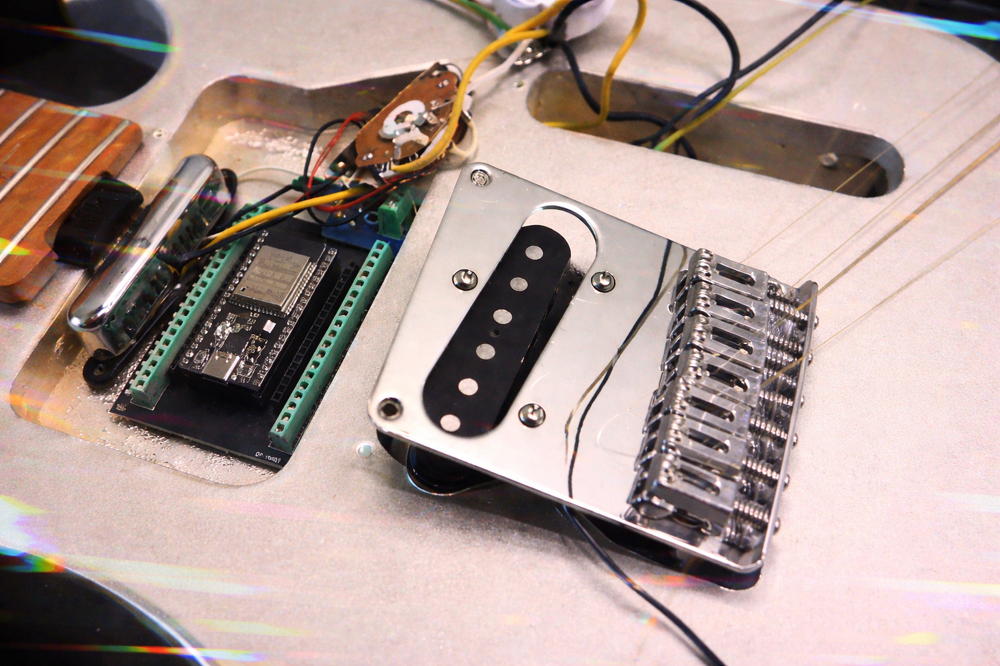

# ChaosField



**Electromagnetic entropy harvester and real-time analysis GUI for guitar pickup coils.**

This is the research prototype for Nocturnus, part of the [Null Order Collective](https://github.com/JupitersGhost/Null-Magnet) guitar TRNG fleet. The goal: prove that a de-potted, ungrounded single coil guitar pickup is a viable physical entropy source.

It works.

---

## What It Does

A guitar pickup coil is an antenna. Ungrounded and de-potted, it picks up electromagnetic interference from everything nearby: phones, hands, fluorescent lights, other guitars, bodies moving through the room. That interference is noisy, unpredictable, and physically grounded in the real world.

ChaosField captures that signal, conditions it, and measures its entropy quality in real time.

**ESP32 firmware** (`chaosfieldarduinoesp32.ino`):
- Samples the pickup coil via ADC at GPIO34 (ADC1, safe with WiFi active)
- Mixes pickup ADC, hardware TRNG (`esp_random()`), timing jitter, and WiFi scan timing/RSSI
- Von Neumann debiasing to remove bias from the raw bitstream
- SHA-256 conditioning/expansion on-device
- Streams binary packets over serial at 921600 baud (CRC16-CCITT framed)

**Python GUI** (`chaosfield.py`):
- Real-time live graphs: raw ADC waveform, Von Neumann debiased bytes, conditioned output
- Shannon entropy (bits/byte)
- Min-entropy
- NIST-style monobit frequency test
- Runs test
- Serial correlation
- Chi-square uniformity
- Contribution meters: pickup energy, jitter span, TRNG mix, WiFi networks visible
- Built with PySide6 + pyqtgraph

---

## Hardware

| Part | Notes |
|------|-------|
| ESP32-WROOM-32 / NodeMCU 38-pin | Any ESP32 with ADC1 works |
| Single coil guitar pickup | De-potted, ungrounded for maximum EMF sensitivity |
| USB cable | For serial connection to PC |

**Wiring:**
```
Pickup HOT  ->  GPIO34 (ADC1)
Pickup GND  ->  GND
```

> Note: This is a measurement/research tool, not a hardened crypto RNG. The ungrounded pickup configuration intentionally maximizes noise pickup for entropy research purposes.

---

## Installation

**Firmware:**
1. Open `chaosfieldarduinoesp32/chaosfieldarduinoesp32.ino` in Arduino IDE
2. Install ESP32 board support if needed
3. Flash to your ESP32
4. Close Arduino Serial Monitor before launching the GUI (GUI needs exclusive port access)

**GUI:**
```bash
pip install PySide6 pyqtgraph numpy pyserial
python chaosfield.py
```

Select your COM port, set baud to 921600, connect.

---

## What You'll See

At idle (pickup sitting on a desk) the signal is low but not zero. EMF from nearby devices, power lines, and the environment keeps it alive.

Move your phone near the coil. The pickup energy meter spikes. Shannon entropy climbs. The ADC waveform goes chaotic.

Strum a guitar near the coil. The signal goes wild.

This is the behavior that makes pickup EMF a viable entropy source: it is continuously sensitive to the physical environment in ways that are unpredictable and unrepeatable.

---

## Context

ChaosField is a prototype for **Nocturnus**, the fourth guitar in the Null Order Collective. The full Nocturnus implementation will combine pickup EMF harvesting with a piezo sensor and ESP32, feeding the CHIRASU network's post-quantum key generation pipeline (Kyber-512 / Falcon-512) via [Null Magnet](https://github.com/JupitersGhost/Null-Magnet).

The other guitars in the fleet:
- **Neptonius** — piezo + ESP32
- **Spectra** — piezo + RGB LED + ESP32
- **Thalyn** — piezo + OLED health display + ESP32
- **Sylvia** — piezo + ball tilt sensor + ESP32

---

## License

MIT. Build weird things.